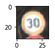
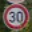

# **Traffic Sign Recognition** 

## Writeup

---

**Build a Traffic Sign Recognition Project**

This project demonstrates traffic sign classification using a convolutional neural network coupled with minimal image pre-processing. Training/validation/test images come from a provided collection of German traffic signs and samples obtained via Google Street View in/around Düsseldorf and Hamburg.

Neural network structural and procedural hyperparameter evaluation was emphasized over image pre-processing techniques.

The steps performed in this project and detailed in the associated report were, as follows:
1. **Load provided images (really: step 0)**
   * Loads training, validation, and test images from pickle files (serialized Python data).
1. **Summarize images**
   * Prints text summaries of dataset and individual image dimensions.
1. **Analyze and display Images**
   * Plots label distribution and samples of each label.
1. **Pre-Process and display Images**
   * Perform simple grayscale and/or normalization pre-processing to (a) constrain training/validation permutations and (b) help me emphasize network structure and hyperparameters.
1. **Build model and architecture**
   * Builds logits and feedback infrastructure. Also includes methods for training and evaluating the model using batched inputs.
1. **Train & evaluate vs validation set**
   * Automates (a) building the model with a spread of key structural/procedural hyperparameters and (b) evaluating it, repetitively to isolate the best example.
1. **Evaluate vs test set**
   * Evaluates the best, trained model vs a provided test set of images.
1. **Load and display new images**
   * Loads and pre-process ad hoc images taken from Google Street View in/around Düsseldorf.
1. **Evaluate vs new images and analyze performance**
   * Evaluates the best, trained model vs above images, the analyze performance by printing/plotting label prediction for each.

These map approximately to the project rubric points, as detailed below.

## Rubric Points

### See: [Rubric Points](https://review.udacity.com/#!/rubrics/481/view)  

---
### 1. Files Submitted

#### 1.1 Submission Files

_The project submission includes all required files._

See: [GitHub Repo](https://github.com/michael-kitchin/CarND-Traffic-Sign-Classifier-Project)

* The Traffic_Sign_Classifier.ipynb notebook file with all questions answered and all code cells executed and displaying output.
   * [Traffic_Sign_Classifier.ipynb](https://github.com/michael-kitchin/CarND-Traffic-Sign-Classifier-Project/blob/master/Traffic_Sign_Classifier.ipynb)
* An HTML or PDF export of the project notebook with the name report.html or report.pdf.
   * [report.html](https://github.com/michael-kitchin/CarND-Traffic-Sign-Classifier-Project/blob/master/report.html)
* Any additional datasets or images used for the project that are not from the German Traffic Sign Dataset.
   * [input_data/real_signs](https://github.com/michael-kitchin/CarND-Traffic-Sign-Classifier-Project/tree/master/input_data/real_signs) (attribution: Google Street View)
* Your writeup report as a markdown or pdf file.
   * [README.md](https://github.com/michael-kitchin/CarND-Traffic-Sign-Classifier-Project/blob/master/README.md) (this file)
---
### 2. Dataset Exploration

#### 2.1 Dataset Summary
         
_The submission includes a basic summary of the data set._

Once loaded, basic metrics about the provided images and sets were printed for verification and reference.

```
Number of training examples = 34799
Number of testing examples = 12630
Image data shape = (32, 32, 3)
Array data shape = (34799, 32, 32, 3)
Number of classes = 43
```
      
#### 2.2. Exploratory Visualization
          
_The submission includes an exploratory visualization on the dataset._

A distribution of image vs label counts and samples of each label were plotted for verification and reference.

Plot:


Examples:





See [report.html](https://github.com/michael-kitchin/CarND-Traffic-Sign-Classifier-Project/blob/master/report.html) for remainder.

---
### 3. Design and Test a Model Architecture

#### 3.1 Preprocessing

_The submission describes the preprocessing techniques used and why these techniques were chosen._

After this, parameterized pre-processing functions were developed to enable multiple, repetitive evaluations. Options were limited to grayscaling and amplitude normalization.

Samples of every label and pre-processing option were plotted for verification and reference.

Examples:


      
See [report.html](https://github.com/michael-kitchin/CarND-Traffic-Sign-Classifier-Project/blob/master/report.html) for remainder.

#### 3.2 Model Architecture
         
_The submission provides details of the characteristics and qualities of the architecture, including the type of model used, the number of layers, and the size of each layer. Visualizations emphasizing particular qualities of the architecture are encouraged._

Model construction and evaluation was madularized to enable experimentation with structural hyperparameters such as convolution layer depth. This required tracking these hyperparameters in order to instantiate models compatible with the dimensionality of best weights discovered during training.

Developing and evolving this modularity imparted valuable understanding of the TensorFlow API and graph lifecycle.     

#### 3.3. Model Training
          
_The submission describes how the model was trained by discussing what optimizer was used, batch size, number of epochs and values for hyperparameters._

Training and verification steps were evaluated over multiple runs (~2000) using automatically-generated ranges of hyperparameters, both procedural (e.g., batch size, epoch count, dropout fraction, learning rate, initialization parameters) and structural (e.g., convolution layer depth). Permutations were shuffled and repeated to minimize unanticipated, cumulative effects.

The `AdamOptimizer` was selected due to its general robustness, simplicity, and attractive traits such as (apparently) built-in, interactive learning rate reduction.

This effort yielded valuable experience, but may have been over-emphasized due to general unfamiliarity with the domain and TensorFlow, specifically.   
      
#### 3.4 Solution Approach
         
_The submission describes the approach to finding a solution. Accuracy on the validation set is 0.93 or greater._

In addition to the systematic evaluation of hyperparameters, described above the training algorithm optimized execution, as follows:
* Validation accuracy and related configurations were tracked and ranked at conclusion of all runs for verification and reference
* Weights and configurations were stored whenever improvement on previous, best accuracy was identified, regardless of current epoch
* Training runs were terminated whenever accuracy consistently degraded (i.e., less than observed best in a given run for (n) epochs) 

This approach routinely produced validation accuracy greater than 0.98.
```
Top 3 results:
Accuracy = 0.980 / Config = [0.0, 0.10000000000000001, 0.0012999999999999999, 67, 0.5, 128, True, True, 24, 64]
Accuracy = 0.975 / Config = [0.0, 0.10000000000000001, 0.0012999999999999999, 22, 0.5, 128, True, True, 24, 64]
Accuracy = 0.970 / Config = [0.0, 0.10000000000000001, 0.0012999999999999999, 8, 0.5, 128, True, True, 24, 64]
```

Test accuracy was routinely greater than 0.95.
```
Accuracy (Test) = 0.950673000641
```

See [report.html](https://github.com/michael-kitchin/CarND-Traffic-Sign-Classifier-Project/blob/master/report.html) for more detailed results.

---
### 4. Test a Model on New Images
       
#### 4.1 Acquiring New Images

_The submission includes five new German Traffic signs found on the web, and the images are visualized. Discussion is made as to particular qualities of the images or traffic signs in the images that are of interest, such as whether they would be difficult for the model to classify._

Ten new images of signs were captured via screenshot from Google Street View, taken from in/around Düsseldorf and Hamburg. 

Image labels were identified via provided `signnames.csv` file and incorporated into the filenames, as shown:
```
$ ls
label-13.png  label-1.png   label-25.png  label-33.png  label-5.png
label-17.png  label-22.png  label-2.png   label-35.png  label-7.png
$
```
New images:





    
#### 4.2 Performance on New Images
       
_The submission documents the performance of the model when tested on the captured images. The performance on the new images is compared to the accuracy results of the test set._

At first, performance on new images proved very low (0.10), approximate to random results. The cause proved to be inconsistencies between the color model of images loaded from the provided pickle files vs acquired PNG files. 

This was due to use of `matplotlib` instead of `cv2` for image loading, due (in turn) to unavailability of `cv2` on the provided AMI. Evaluation and resolution of this concern delayed project completion for at least a week. 

See [Issue Report](https://github.com/udacity/sdc-issue-reports/issues/768) for additional information.

Once resolved, performance on new images was routinely greater than 0.90.
```
Accuracy (Real) = 0.900
```

#### 4.3 Model Certainty - Softmax Probabilities
         
_The top five softmax probabilities of the predictions on the captured images are outputted. The submission discusses how certain or uncertain the model is of its predictions._

The top five softmax preditiction probabilities were evaluated, printed, and plotted on logarithmic scales for reference and verification. 

In general, the devloped model was drastically more certain of its best choice than nearest alternatives, with 1st-to-2nd choice multiples routinely greater than 10e2.


See [report.html](https://github.com/michael-kitchin/CarND-Traffic-Sign-Classifier-Project/blob/master/report.html) for more detailed results.

---
### Visualizing Working State

Activation layer working state was also printed and plotted for verification and reference using the supplied `outputFeatureMap` function.

This proved usable for only one of the activation layers, however (the first).


See [report.html](https://github.com/michael-kitchin/CarND-Traffic-Sign-Classifier-Project/blob/master/report.html) for more detailed results.
